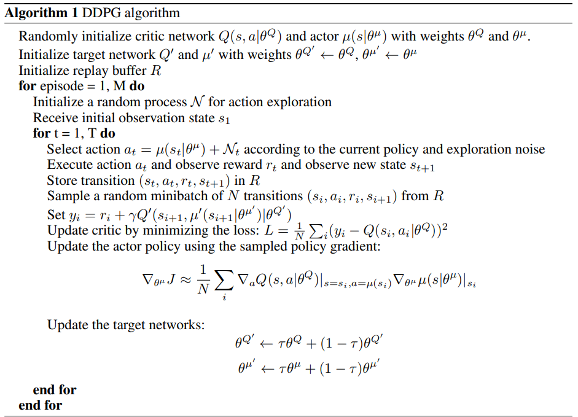

# Collaboration Compentition Project Report

For instructions to run see [README.md](./README.md)

## Implementation Details

The Project consists of the following files:

    - Agent.py                  -- Implementation of a Deep Deterministic Policy Gradient (DDPG) Agent
    - Actor.py                  -- Actor (Policy) model used by the agent
    - checkpoint_actorA.pth     -- Trained actor model weights for player A
    - checkpoint_actorB.pth     -- Trained actor model weights for player B
    - checkpoint_criticB.pth    -- Trained critic model weights for Player A
    - checkpoint_criticB.pth    -- Trained critic model weights for Player B
    - Tennis.ipynb              -- Jupyter notebook used to train the DDPG Agent  
    - Critic.py                 -- Critic (Value) model used by the agent 
    - Noise.py                  -- An implementation of an Ornstein-Uhlenbeck process to add noise to the training
    - ReplayBuffer.py           -- Double ended queue with random sampling methods to store the learning experiences

### Learning Algorithm and Neural Network

For this project we used an Multi-Agent Actor-Critic (**MADDPG**) approach based on the Deep Deterministic Policy Gradient (**DDPG**) algorithm. Based on the [Deep Deterministic Policy Gradient conference paper](https://arxiv.org/pdf/1509.02971.pdf) (*Lillicrap, 2015*) and [Multi-Agent Actor-Critic for Mixed Cooperative-Competitive Environemnts](https://papers.nips.cc/paper/2017/file/68a9750337a418a86fe06c1991a1d64c-Paper.pdf) (*Lowe, 2017*)

The Agent implements an actor-critic method; meaning an actor model for the target policy and a critic model for learning. The Agent uses a Ornstein-Uhlenbeck process for adding noise to the exploration due to the efficiency in physical control problems with inertia. (*Wawrzynski, 2015*). It also utilizes a ReplayBuffer to store the environment experiences so we can apply learning steps in mini-batches instead of continuous updates to prevent correlation between sequence tuples and potentially diverging from the optimal policy. All learning steps are applied using a soft update procedure which is used to slowly blend the regular network weights with the target network.


The [actor model](./Actor.py) is the current policy for deterministic state-action mappings. It consists of three fully connected layers, where the first layer is the state_size * 2 to 256 units, the second layer is a mapping of 256 units to 256 units, and the third connected layer was 256 units to the action_size. The three layers were initialized with a uniform distribution of 256 (fc1), 256 (fc2) and [-3x10-3, 3x10-3] (fc3) respectively. The neural network used the rectified non-linearity (relu) for both FC1 and FC2 and the final layer (FC3) used a tanh function to bound the actions.


The [critic model](./Critic.py) is used evaluate the optimal state-action policy using a Q-learning equation, implemented in the Agent. The critic model used four layers and also used *batched normalization* (Ioffe & Szegedy, 2015) to normalize each dimension across samples in the mini-batch, this is due to the environment having multiple physical units (such as position, torque and velocity). The network consists of three fully connected layers, where the first layer was the state_size * 2 to 256 units, the second layer was 256 units + action_size * 2 to 256 units,  and the final layer was 256 units to 1 unit. The three layers were initialized with a uniform distribution of 256 (fc1), 256 (fc2), and [-3x10-3, 3x10-3] (fc3) respectively. The neural network used the rectified non-linearity (relu) for FC1, and FC2 layers, it also concatenated the sequences and actions of the first layer to a single dimension.

For learning the pseudo code was as follows (*Lillicrap, 2015*):


Our implementation used two of the above defined agents with a shared replay buffer based on the Multi-Agent Decentralized Actor (Lowe, 2017):


The implementation of the pseudo code in the [Tennis.ipynb](./Continuous_Control.ipynb) starts by initializing two agents.

```python
memory = ReplayBuffer(action_size, seed=0)                                 # Shared memory buffer
agentA = Agent(state_size, action_size, memory, 0)                         # instance of first agent
agentB = Agent(state_size, action_size, memory, 1)                         # instance of second agent
```

The agent then initializes the actor and critic networks as defined above, as well as a single shared ReplayBuffer.
We then set up a iterative loop of a maximum of 5000 episodes and initialize a deque of 100 samples (The solved condition is if the mean score of the last 100 episodes were greater than 0.5). 

For each episode it will reset the environment, obtain the initial state and begin interacting for with the Tennis environment. For every timestep t, the both agents get the associated action given the state, applying noise to each action while it is learning. They then takes the given actions and each applies it to the environment, retrieving the next states, actions values and if the environment is done. It then applies the step function to the agents for performing the soft updates. First it updates the shared replay buffer with the experience and then if the number of runs matches the batch update, it will pull a random sampling from the replay buffer, apply the actions, states to the actor and critic networks and then apply experience as a soft update to both models.
```python
actionA = agentA.get_action(states, add_noise=True)                 # Get the agent action, add noise to improve learning
actionB = agentB.get_action(states, add_noise=True)                 # Get the agent action, add noise to improve learning
actions = np.concatenate((actionA, actionB), axis=0).flatten()      # Combine agent actions
env_info = env.step(actions)[brain_name]                            # send all actions to tne environment

next_states = np.reshape(env_info.vector_observations, (1, -1))     # get next state per agent
rewards = env_info.rewards                                          # get reward for per agent
dones = env_info.local_done                                         # see if episode finished
agentA.step(states, actions, rewards[0], next_states, dones[0], t)  # Train the agent
agentB.step(states, actions, rewards[1], next_states, dones[1], t)  # Train the agent
```

If the environment is solved then it will exit the loop and save the target actor and critic models for both agents and plot the rewards over time.

### Hyper Parameters

|Parameter| Value|
--- | --- |
Epsilon start | 1.0 |
Epsilon Discount Factor | 0.99 |
Noise Discount Factor | 1e-6 |
Soft Update Rate Actor | 1e-3 |
Soft Update Rate Critic | 1e-3 |
Interpolation param (τ) | 1e-3 |

### ReplayBuffer Hyper Parameters

|Parameter| Value|
--- | --- |
Replay buffer size | 1e6 |
Batch size | 128 |

### Noise Hyper Parameters

|Parameter| Value|
--- | --- |
θ | 0.15 |
σ | 0.2 |

## Plot

 The figure below is the plot of the rewards over runs during the training episodes


> * [Episode 100]	Average Score (Last 100 episodes): 0.0250
> * ...
> * [Episode 1200]	Average Score (Last 100 episodes): 0.1959
> * ...
> * [Episode 2200]	Average Score (Last 100 episodes): 0.2150
> * [Episode 2300]	Average Score (Last 100 episodes): 0.3880
> * ...
> * [Episode 2828]	Average Score (Last 100 episodes): 0.5150

Solved in 2827 episodes!	Average Score (Last 100 episodes)=0.5150

## Future work

Future improvements could be made by expanding the implementation of the MADDPG algorithm to include the Optional Soccer environment which is more difficult and more agents to deal with, including two goalies and two scoring agents.

Another improvement could be using policy ensemble to keep the policies more robust in case we replace one of our agents with a differently trained one. We could change up the sub-policy at every episode and maintain a different replay buffer per sub-policy.

## References

Lowe, Wu, Mordatch. Multi-Agent Actor-Critic for Mixed Cooperative-Competitive Environments. 31st Conference on Neural Information Processing Systems, 2015.

Wawrzynski, Paweł. Control policy with autocorrelated noise in reinforcement learning for robotics.
International Journal of Machine Learning and Computing, 5:91–95, 2015.

Continuous Control With Deep Reinforcement Learning. Lillicrap, Hunt, Pritzel, Heess, Erez, Tassa, Silver, and Wierstra. eprint arXiv, 2015

Ioffe, Sergey and Szegedy, Christian. Batch normalization: Accelerating deep network training by
reducing internal covariate shift. arXiv preprint arXiv:1502.03167, 2015.